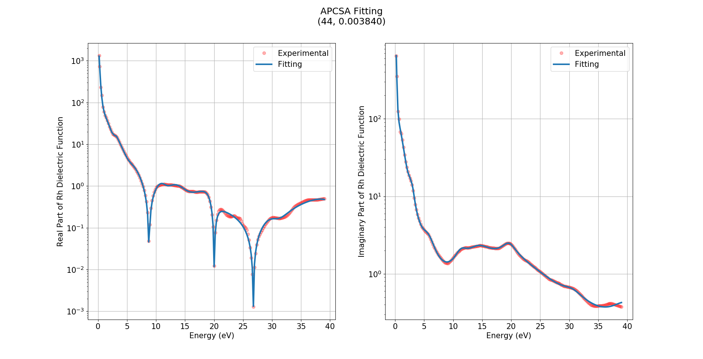
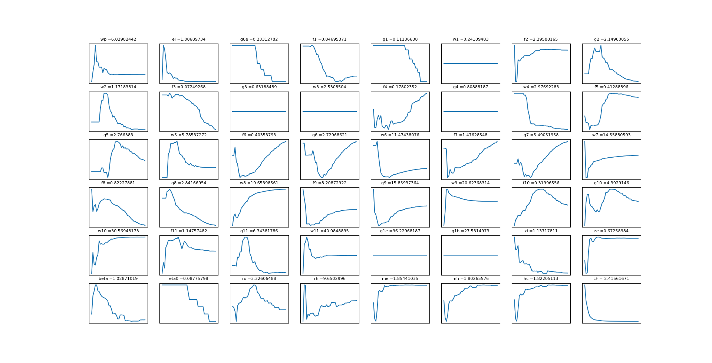

# Data-visualization

## About

This repo contains scripts made for a specific application in the development of an extended Drude-Lorentz model. These scripts are implemented in Python programming language and are specially useful because all graphs are updated in real time as new data points are generated.

### adjust.py

This script will generate a graph like the following:

Displaying both the real and imaginary parts of the dielectric function for rhodium (Rh), showing the generated fit based on the developed model and the reported expiremental values from literature.

Both graphs are updated in real time as the fitting is improved upon generation of new updated parameter values for the developed model.

### grapher.py

This script will generate the following window:

This is probably the most useful of both scripts, since it visualizes the aproximation of the many different parameters of the developed model. This way, through observation it is possible to determine if the value of any given parameter is converging correctly.
